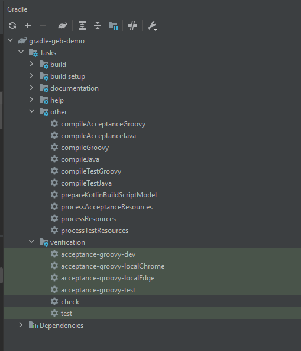

# gradle-geb-demo

Here you will find a basic repository with a demo end to end tests with GEB and Gradle. The main purpose is to give a 
starting playground to learn and try how GEB works. 

## Getting Started

End to end tests are meant to check if the requirements of an application are met. 
The main purpose of GEB is to provide a testing tool that allows to develop automated UI tests for web-based
applications. For detailed explanation you can check their documentation: 
- https://www.gebish.org/manual/current/

## Installation

### Prerequisites:
- Java 11
- Gradle 5.6


## Usage
### Executing tests locally: 
If you are using IntelliJ or any other IDE that supports Gradle, you can directly execute the verification tasks that has been defined
at build.gradle.
Here an image of the tasks of Gradle defined in our project. 



Otherwise you can also execute tasks as follows:
```gradle execute clean task example 
 ./gradlew clean 
```
```gradle execute a verification task example. Substitute ${springBootEnv} by the environment you want to use (see Environments section)
 ./gradlew acceptance-groovy-${springBootEnv} --stacktrace --no-daemon
```

### Executing tests on a Continuos Integration pipeline: 
At continuous integration pipelines where you are running your tests by an agent machine from 
tools like Jenkins, TeamCity, AzureDevOps, GitHub Actions etc you must be aware of certain pre-requisites for these execution agents: 
1. In case you want to execute tests in non headless mode you will need to have a browser and its driver installed.
2. If you want to generate images for the reports you will have to execute your tests in non headless mode, so first step is important to be 
taken into account
3. You will need to prepare your agent to have all needed prerequisites 

can use the following command to run your tests: 
### Browser Extensions

It might happen that you need to add an extension to your browser so that 
you can for example authenticate to your application. If this is the case 
you should be adding it by using addExtensions() function to the GebConfig file in the environment 
where you need it:
``` Add extension to Chrome. In this case assuming that Windows-Accounts extension is needed and is found at resources folder
chromeOptions.addExtensions(new File('./Windows-Accounts.crx'))
```
### Environments: 

At GebConfig you will find different environments. Each environment can be used to execute tests with different configurations
so for example, if you want to run locally tests in non headless mode, and in a Continuous Integration pipeline you want to run them in 
headless mode you can configure two different environments. Also can be used to switch between browsers and OS systems. 

Here you can see an example of an environment. In order to use it you must configure a system property with the name of the environment you want to use.
You can also create and add any environment you need. 
```GebConfig.grrovy environment example
 dev {
        driver = {
            WebDriverManager.edgedriver().setup();
            EdgeOptions edgeOptions = new EdgeOptions()
            edgeOptions.setHeadless(true)
            edgeOptions.setPlatformName("LINUX")

            WebDriver driver = new EdgeDriver(edgeOptions)
            driver.manage().window().size = new Dimension(1350, 850)
            return driver
        }
```

If you want to add a new environment  we must define a new TestEnv wich will create a new GradleTask  : 
```GebConfig.grrovy environment example
 def TestEnv = ['dev', 'test', 'localChrome','localEdge', 'newEnvironment']
```

### Test results
You can report certain images using the report function given by GEB
So if you make your spec files extend the GebReportingSpec class you will be able 
to decide which steps of your tests do you want to take screenshots from 

```W3SchoolsSpec
 class W3SchoolsSpec extends GebReportingSpec {
    def homePage = new Home()
    def "The user can search tutorials"() {
        given: "User goes to w3schools page"
            to homePage
            report "User is at Home Page"
 }
 ```
The test execution report generated can be found at the report folder that you specified at 
GebConfig.groovy file using the reportsDir variable. 

## Deployment

Add additional notes to deploy this on a live system

## Contributing
Pull requests are welcome. For major changes, please open an issue first to discuss what you would like to change.


